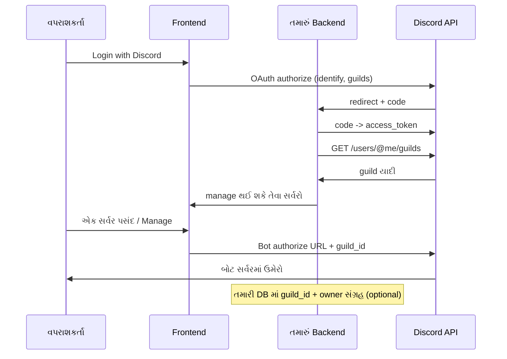

# Discord OAuth પછી સર્વરો દેખાડવા અને બોટ સેટ અપ — વર્કફ્લો (Frontend + Backend)

આ દસ્તાવેજ તમને સમજાવે છે કે વપરાશકર્તા Discord પર authorize કર્યા પછી તેની સર્વરની યાદી કેવી રીતે બતાવી શકાય, તે સર્વર પસંદ કર્યા પછી બોટ કેવી રીતે ચોક્કસ ગિલ્ડમાં initialize થાય — અને આ બધું **possible** છે કે નહીં.

---

## ટૂંક સવાલ: Possible છે?

**હા.** Discord ની official OAuth2 API અને authorization URLs વાપરીને આ જ પેટર્ન મોટાભાગની બોટ dashboard સર્વિસીસ ઉપયોગમાં લે છે (MEE6, Dyno જેવી style).

મહત્વપૂર્ણ મર્યાદા:

- પહેલા તમને **વપરાશકર્તા** નો OAuth મળે છે (`guilds` scope સાથે) — જેથી તમે તે વપરાશકર્તા જેના સર્વરના સભ્ય છે તેની યાદી જોઈ શકો.
- બોટને સર્વરમાં ઉમેરવા માટે બીજું પગલું જોઈએ: Discord નું **“Add to Server” / bot authorize** URL (scopes: `bot`, `applications.commands`). આમાં `guild_id` query parameter વાપરીને તમે પહેલેથી જ ચોક્કસ સર્વર પસંદ કરાવી શકો.

એટલે સંપૂર્ણ ફ્લો સામાન્ય રીતે **બે પગલાં** નો હોય છે: (1) user login + guild list, (2) selected guild માટે bot install.

---

## ઉચ્ચ સ્તરે શું થાય છે?



---

## Backend પર શું કરવું પડે?

### 1. Discord Developer Portal માં સેટિંગ

- તમારી **same application** માં OAuth2 redirect URLs તમારી વેબસાઈટના callback પર સેટ કરો (ઉદાહરણ: `https://api.tamasari.com/auth/discord/callback`).
- પહેલા સ્ટેપ માટે scopes (વપરાશકર્તા login): ઓછામાં ઓછું **`identify`** અને **`guilds`** — જેથી `/users/@me/guilds` ચાલે.
- બોટ invite માટે URL Generator માં **`bot`** + **`applications.commands`** — આ વપરાશકર્તાને બીજી વાર ખોલવું પડશે જ્યારે તે કોઈ સર્વર પસંદ કરે.

### 2. OAuth callback — authorization code બદલી access token

વપરાશકર્તા authorize કર્યા પછી Discord તમારા `redirect_uri` પર **`code`** મોકલે છે.

Backend કરે છે:

1. `POST https://discord.com/api/oauth2/token` — `client_id`, `client_secret`, `grant_type=authorization_code`, `code`, `redirect_uri`.
2. જવાબમાં **`access_token`** (વપરાશકર્તા માટે) અને કેટલીક વાર **`refresh_token`** મળે છે — session અથવા DB માં સલામત રીતે સંગ્રહ કરો (encrypted).

### 3. સર્વરની યાદી મેળવવી

Backend Discord ને કહે છે:

- `GET https://discord.com/api/v10/users/@me/guilds`
- Header: `Authorization: Bearer <user_access_token>`

Discord દરેક guild માટે roughly આ મોકલે છે: `id`, `name`, `icon`, **`owner`** (boolean), **`permissions`** (string — bitmask).

### 4. કયા સર્વરો દેખાડવા? (“Manage Server” જેવું ફિલ્ટર)

Dashboard માં સામાન્ય નિયમ (તમારી છબીમાં જેવું):

- માત્ર તે guild બતાવો જ્યાં વપરાશકર્તા **`MANAGE_GUILD`** પરમિશન ધરાવે છે, અથવા **`owner`** છે.

Bitmask તપાસ (concept):

- `permissions` ને integer તરીકે પાર્સ કરો.
- `(permissions & MANAGE_GUILD)` નો bitwise check કરો — અથવા owner હોય તો હંમેશા દર્શાવો.

જેથી ખોટા સર્વર પર બોટ સેટ અપ ન બતાવાય અને UX સ્વચ્છ રહે.

### 5. બોટ “initialization” તમારી તરફથી શું છે?

Discord બોટ તમારો Node બોટ જ રહેશે (`npm start`). વેબ ફ્લો આ કરે છે:

1. વપરાશકર્તા સર્વર પસંદ કરે.
2. Frontend તે સર્વરની **`guild_id`** સાથે Discord નું authorize URL ખોલે છે:

   ```
   https://discord.com/oauth2/authorize
     ?client_id=YOUR_APPLICATION_ID
     &permissions=YOUR_BOT_PERMISSIONS_INTEGER
     &scope=bot%20applications.commands
     &guild_id=SELECTED_GUILD_ID
     &disable_guild_select=true
   ```

   (`disable_guild_select=true` વૈકલ્પિક છે — વપરાશકર્તા બીજું સર્વર બદલી ન શકે તે માટે.)

3. વપરાશકર્તા Discord પર OK કર્યા પછી બોટ તે સર્વરમાં ઉમેરાઈ જાય છે.

તમારું **backend** (optional પણ ઉપયોગી):

- જ્યારે bot OAuth પૂર્ણ થાય ત્યારે redirect પર **`guild_id`** મળી શકે — તેને તમારી database માં `(user_id, guild_id, settings)` સાથે સાચવો.
- આ પછી તમારી API “આ guild માટે feature on/off” જેવું control કરી શકે; command deploy (`npm run deploy-commands`) તે guild માટે અલગ સ્ક્રિપ્ટ થી થઈ શકે અથવા global રાખી શકાય — product ના આધારે.

---

## Frontend પર શું કરવું પડે?

1. **“Login with Discord”** બટન → તમારા backend દ્વારા બનેલી URL પર redirect (કે સીધું Discord authorize URL જો state secure રીતે handle થતી હોય).
2. Login પછી backend session (HTTP-only cookie અથવા JWT) સાથે **GET /api/me/guilds** જેવું endpoint — જવાબમાં ફિલ્ટર કરેલી guild યાદી.
3. દરેક guild માટે કાર્ડ: નામ, આઇકોન URL (`https://cdn.discordapp.com/icons/{guild_id}/{icon}.png`), મેમ્બર કાઉન્ટ જોઈતું હોય તો extra API લાગે — મૂળ `/users/@me/guilds` માં કાઉન્ટ ન હોય તો જુદો સર્વર preview API વિચારવો (કમ્પ્લેક્સિટી વધે).
4. **“Manage Server” / “Add bot”** ક્લિક → ઉપર વર્ણવ્યું તે પ્રમાણે Discord bot authorize URL નવી ટેબ અથવા same window માં ખોલો (`guild_id` સેટ સાથે).
5. સફળતા પછી તમારા dashboard માં તે guild ને “configured” દર્શાવો — backend webhook અથવા success redirect પર status અપડેટ કરો.

---

## સુરક્ષા / પ્રોડક્શન નોંધો

- **`client_secret`** માત્ર backend પર — ક્યારેય frontend અથવા Git માં નહીં.
- વપરાશકર્તા OAuth **`state`** પરામીટર વાપરો (CSRF રોકવા).
- Token ને encrypt કરીને સંગ્રહ કરો; refresh token વાપરતા હોય તો વપરાશકર્તા સહમતિ અને revocation ની નીતિ સ્પષ્ટ રાખો.
- વધારે સત્તા scopes (`email` વગેરે) માત્ર જરૂર હોય ત્યારે જ.

---

## તમારા હાલના Node બોટ સાથે લિંક

- બોટ પોતે Discord gateway થી online રહે છે (જેમ `npm start`).
- વેબ dashboard ફક્ત **યૂઝરને સાચા સર્વરમાં બોટ ઉમેરાવવા** અને **તમારી config DB** ભરવામાં મદદ કરે છે.
- Guild માં slash commands પહેલેથી deploy કર્યા હોય અથવા global રાખ્યા હોય — તે તમારી deploy નીતિ પર નિર્ભર છે.

---

## આગળ શું?

જ્યારે તમે કહેશો કે હવે implement કરવું છે, ત્યારે આપણે ચોઈસ કરી શકીએ:

- Backend stack (Express/Fastify + session),
- Frontend (React/Vanilla),
- અને તમારી `.env` માં `DISCORD_CLIENT_SECRET`, redirect URIs જોડવા.

મુખ્ય ફ્લો repository માં implement થઈ ચૂક્યો છે (`server/`, `dashboard/`). નીચે “Implementation” જુઓ.

---

## Implementation (repository માં ઉમેરાયું)

- **Backend:** `server/` — Express API, JWT session cookie, Discord OAuth (user + bot callback), MongoDB (`User`, `GuildInstallation`, `PendingBotOAuth`).
- **Frontend:** `dashboard/` — Vite + React; dev દરમ્યાન `/api` proxy થી `localhost:4000` પર જાય છે જેથી OAuth cookies સાચા origin પર રહે.
- **Local ચલાવવું:** MongoDB ચાલુ રાખો → `.env` ભરો (ખાસ `DISCORD_REDIRECT_URI` / `DISCORD_BOT_REDIRECT_URI` = `FRONTEND_URL` + `/api/auth/...`, Discord Portal માં નોંધવા જેટલા જ URL) → ટર્મિનલ 1: `npm run dev:api` → ટર્મિનલ 2: `npm run dev:dashboard` → Discord બોટ માટે અલગ ટર્મિનલમાં `npm start`.
